# CitiFix – AI-Powered Community Issue Detection & Resolution Platform

CitiFix is a full-stack MERN web application that enables citizens to report civic issues while helping municipal authorities manage and resolve them efficiently. The platform leverages AI to analyze uploaded images, detect duplicate reports, prioritize issues, and generate actionable recommendations, creating a smarter and more collaborative civic ecosystem.

---

## 🚀 Live Demo

* **Frontend (Vercel):** `https://citi-fix-blond.vercel.app`
* **Backend (Railway):** `https://citifix-production.up.railway.app`

---

## ✨ Features

### 👥 Citizen Portal

* Secure JWT Authentication
* Report civic issues with image and location
* AI-powered image analysis and category prediction
* AI-generated severity & priority score
* Duplicate issue detection within nearby radius
* Interactive community map
* Upvote community issues
* Track issue progress through status timeline
* Earn reputation points and badges
* Dynamic dashboard with:

  * Active Reports
  * Resolved Issues
  * Community Members
  * Participation Score

---

### 🏛️ Municipal Officer Portal

* View AI-generated municipal recommendations
* Create work orders from recurring issues
* Update work order status
* Start Repair
* Mark Completed
* Mark Resolved
* Manage assigned civic issues

---

### ⚙️ Administrator Portal

* Full access to all municipal features
* Monitor reported issues
* Manage work orders
* Update issue lifecycle
* Administrative oversight of the platform

---

## 🤖 AI Features

* AI image analysis using **Groq LLM**
* Automatic issue categorization
* Severity prediction
* Dynamic priority scoring based on issue description
* AI-generated issue summary
* Duplicate issue detection
* AI municipal recommendations
* Recommended repair actions

---

## 🔄 AI Workflow

Issue Image + Description
→ Groq Vision Analysis
→ AI Category Prediction
→ Severity Detection
→ Dynamic Priority Score
→ Duplicate Detection
→ Municipal Recommendation
→ Work Order Management

---

## 📊 Smart Dashboard

The dashboard statistics are generated dynamically from the database.

* Active Reports
* Resolved Issues
* Community Members
* Participation Score

Community Members automatically increase whenever a new user registers.

Participation Score is calculated based on unique users who have actively contributed by reporting or supporting issues.

---

## 🛠️ Tech Stack

### Frontend

* React
* Vite
* Tailwind CSS
* Axios
* Leaflet Maps
* React Context API

### Backend

* Node.js
* Express.js
* MongoDB Atlas
* Mongoose
* JWT Authentication
* Multer
* Cloudinary

### AI

* Groq LLM

### Deployment

* Frontend → Vercel
* Backend → Railway
* Database → MongoDB Atlas
* Image Storage → Cloudinary

---

## 🔐 Demo Credentials

### 👤 Citizen

Create a new account using **Sign Up**.

---

### 🏛️ Municipal Officer

Email:

```
officer@citifix.gov
```

Password:

```
Officer@123
```

Role:

```
Officer
```

---

### ⚙️ System Administrator

Email:

```
admin@citifix.gov
```

Password:

```
Admin@123
```

Role:

```
Admin
```

---

## 📸 Application Screenshots

### Landing Page

<p align="center">
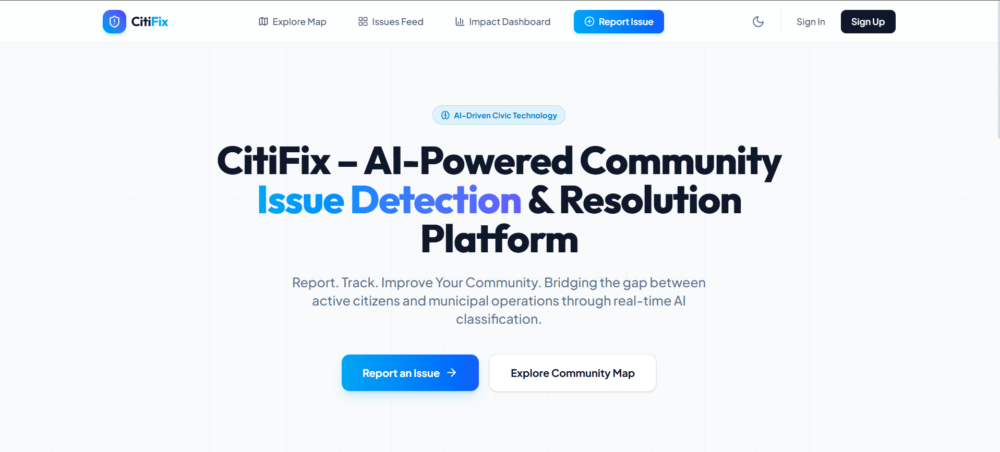
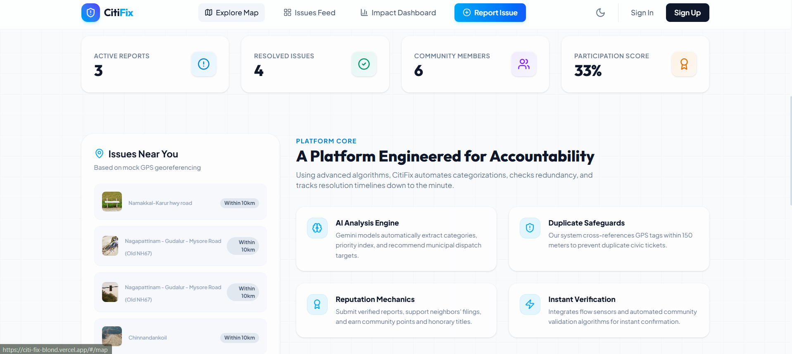
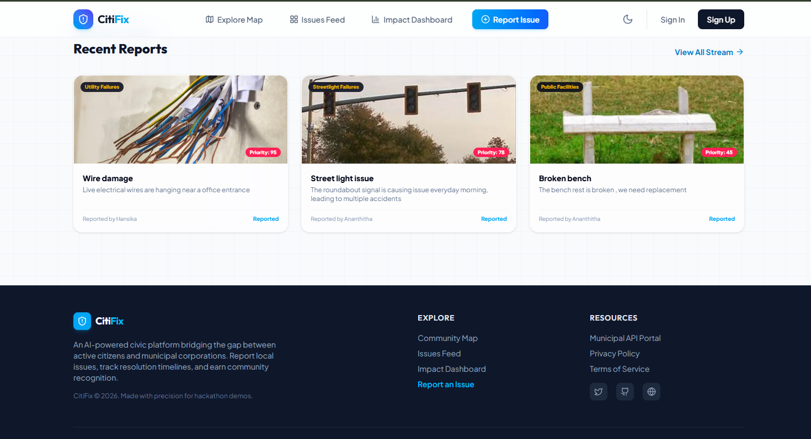
</p>

---

### Authentication

<p align="center">
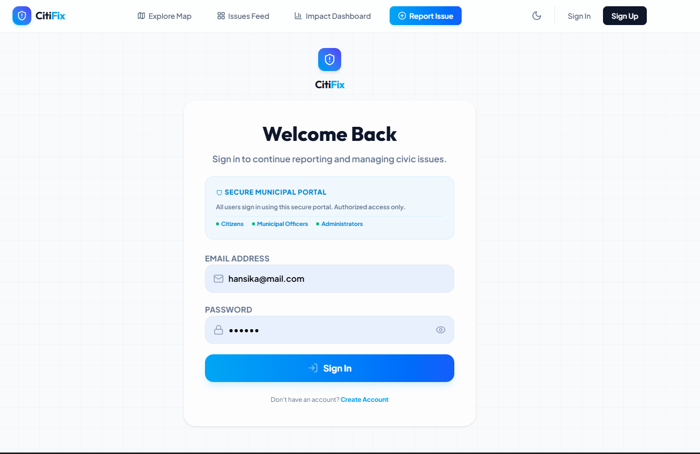
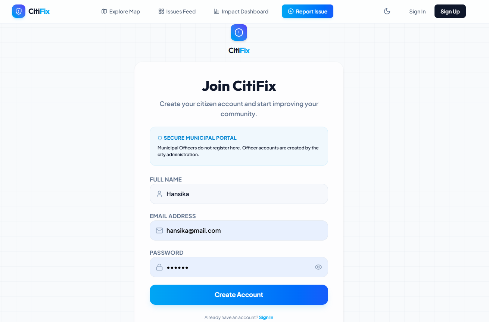
</p>

---

### AI Image Analysis

<p align="center">
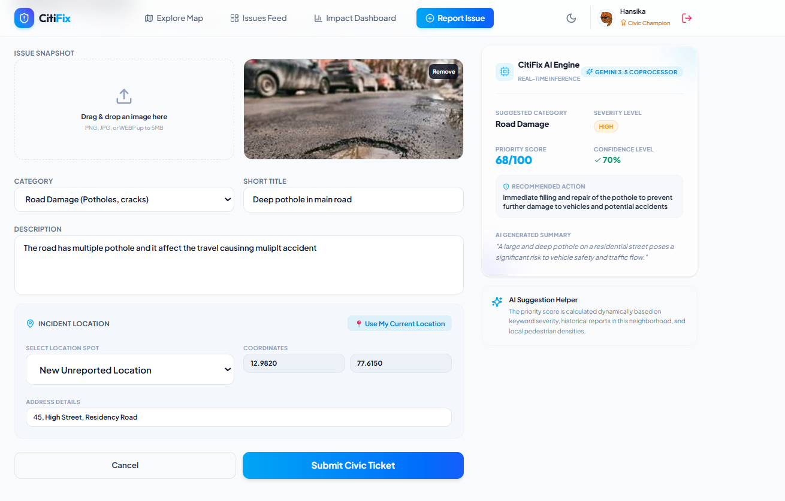
</p>

---

### Duplicate Detection

<p align="center">
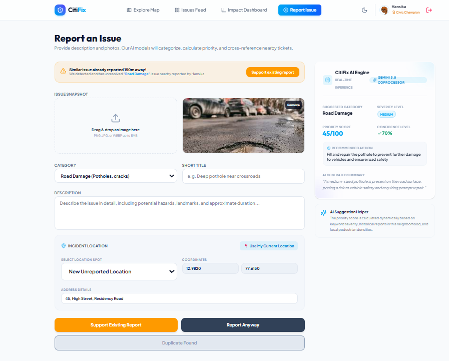
</p>

---

### Community Map

<p align="center">
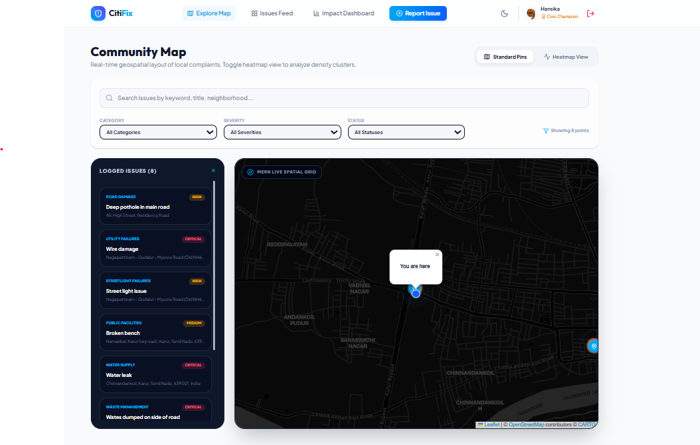
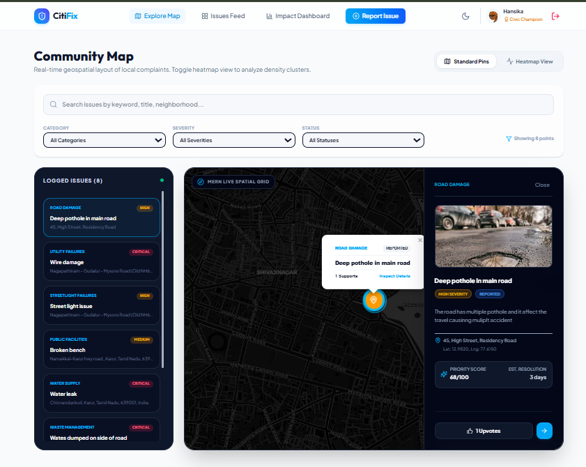
</p>

---

### Impact Dashboard

<p align="center">
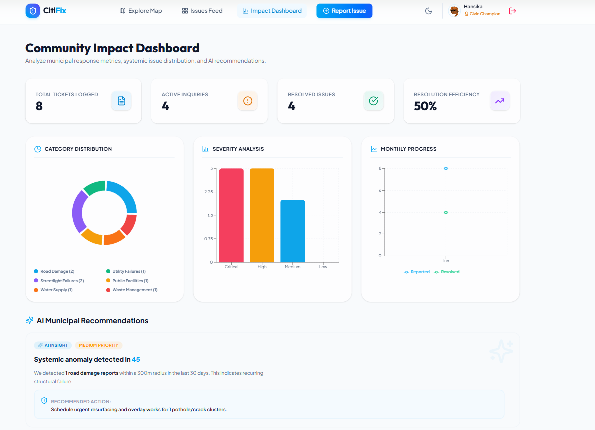
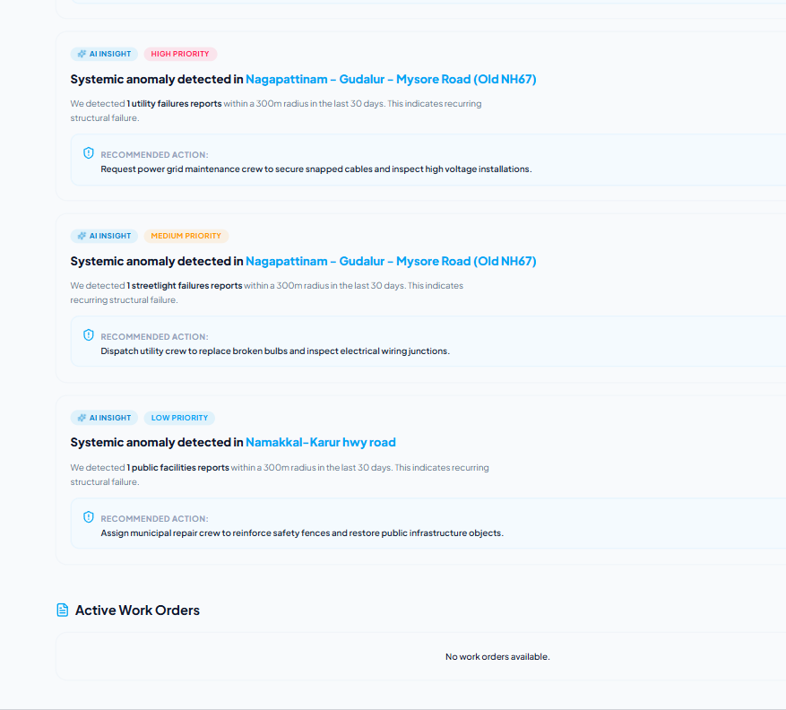
</p>

---

### Citizen Dashboard

<p align="center">
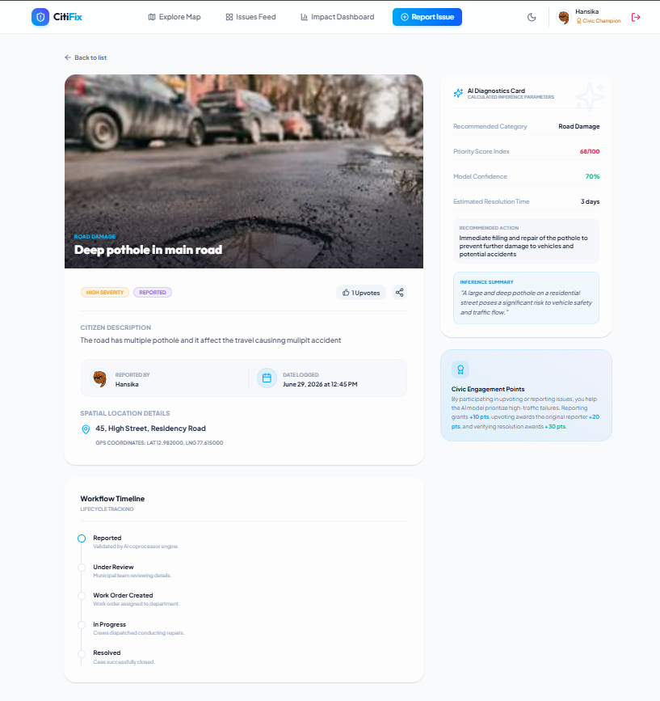
</p>

---

### Municipal Officer Dashboard

<p align="center">
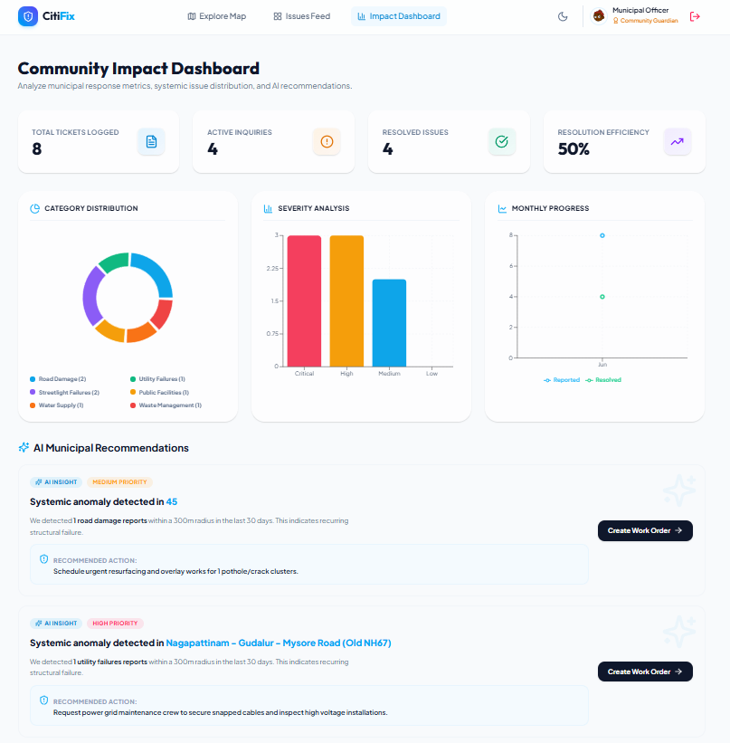
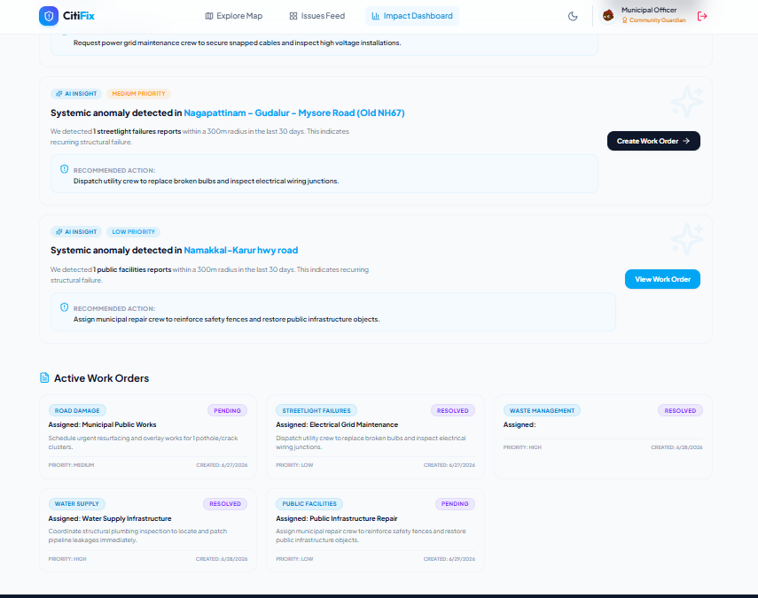
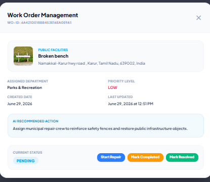
</p>

---

### Administrator Dashboard

<p align="center">
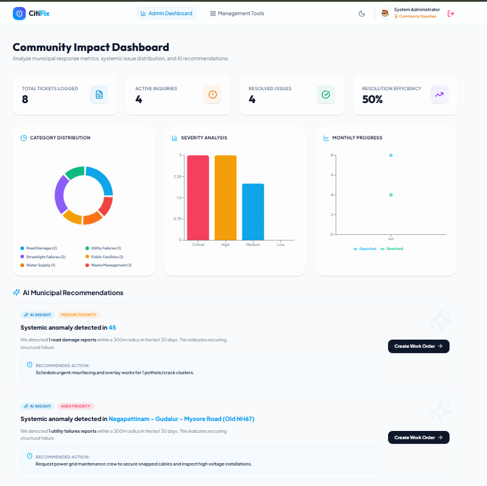
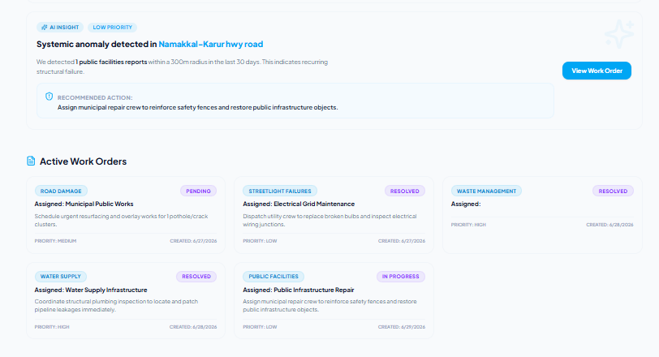
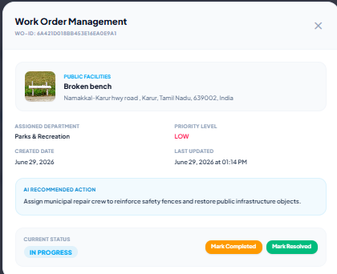
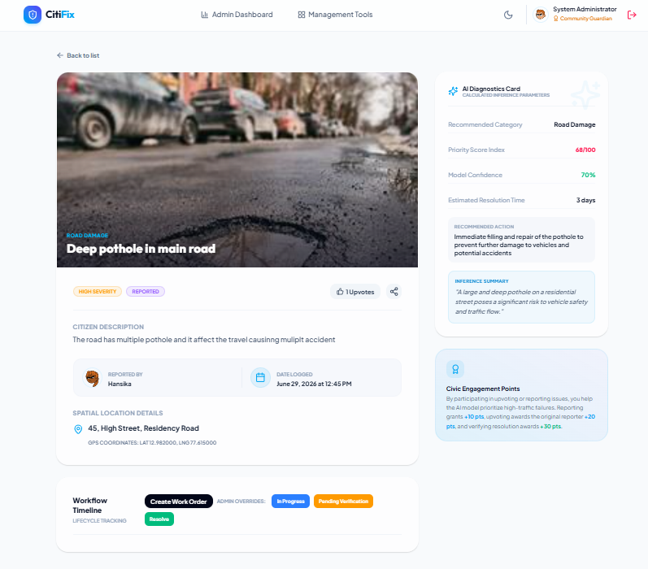
</p>

---

## ⚙️ Local Setup

Clone the repository

```bash
git clone https://github.co/CitiFix.git
```

Install dependencies

```bash
npm run install-all
```

Backend `.env`

```env
PORT=5000
MONGODB_URI=your_mongodb_uri
JWT_SECRET=your_secret
CLIENT_URL=http://localhost:5173

CLOUDINARY_CLOUD_NAME=your_cloud_name
CLOUDINARY_API_KEY=your_api_key
CLOUDINARY_API_SECRET=your_api_secret

GROQ_API_KEY=your_groq_api_key
```

Run locally

```bash
npm run dev
```

---

## 📦 Project Structure

```
CitiFix
├── frontend
├── backend
├── assets
│   └── screenshots
└── README.md
```

---

## 📝 Deployment Note

The original project specification suggested **Google AI Studio (Gemini)** and **Google Cloud Run**.

Due to billing limitations during development, the project was deployed using:

* **Groq LLM** instead of Google AI Studio
* **Railway** instead of Google Cloud Run
* **Vercel** for frontend hosting

The application's functionality remains the same while using these equivalent services.

---
## Project Demonstration Video

A complete walkthrough of CitiFix demonstrating the end-to-end workflow, including:

- Citizen registration and login
- AI-powered issue reporting
- Duplicate detection using geospatial queries
- Community map visualization
- Dynamic dashboard statistics
- Municipal Officer work-order management
- Administrator dashboard
- Issue lifecycle from Reported to Resolved

Video Link:
https://drive.google.com/file/d/1Am21UAPDMgOqkG25fsqFltngFtfxVazV/view?usp=sharing


---

## 👨‍💻 Developed By

**Hansika Saravanakumar**

B.Tech Information Technology
